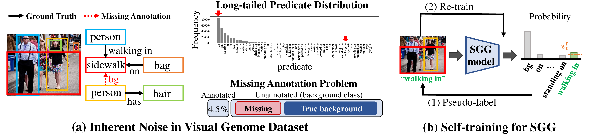

# Adaptive Self-training Framework for Fine-grained Scene Graph Generation


## **Overview**


  
### Addressing the issue: Inherent Noise in Dataset  
* **Challenge 1**: Long-tailed predicate distribution  
The long-tailed predicate distribution in SGG refers to a distribution in which general predicates (e.g. “on”) frequently appear, while fine-grained predicates (e.g. “walking in”) are rarely present. Owing to such a long-tailed predicate distribution inherent in the dataset, existing SGG models tend to make accurate predictions for general predicates, while making incorrect predictions for fine-grained predicates.

* **Challenge 2**: Missing Annotation  
A missing annotations provide incorrect supervision to SGG models as unannotated triplets are carelessly assigned to the background class (i.e., bg), even though some unannotated triplets should have been indeed annotated with another class (See (a)). For example, treating the missing annotation between person and sidewalk as bg may confuse SGG models that are already trained with a triplet ⟨person, walking in, sidewalk⟩. In addition, the prevalence of triplets with the bg predicates between person and sidewalk throughout the dataset would exacerbate the problem.  

### Proposed Framework (**ST-SGG**)
* **ST-SGG**: Self-training framework  
We aim to effectively utilize the unannotated triplets in benchmark scene graph datasets by assigning them accurate pseudo-labels. To this end, we introduce a self-training framework for 
SGG, called **ST-SGG**, which assigns pseudo-labels to confident predictions among unannotated
triplets, and iteratively trains the SGG model based on them (See (b)). By actively assigning the pseudo-labels on fine-grained predicates, **ST-SGG** effectively alleviates the long-tailed problem.


## **Installation**

[INSTALL.md](INSTALL.md)

## **Dataset**

[DATASET.md](DATASET.md)

## **Pre-trained Object Detector**

As ST-SGG framework is composed of two-stage, please download the pre-trained detector from following [source](https://drive.google.com/file/d/1NrqQId-O0K50-ik1cMHJC2ZLaU5eBJcv/view?usp=share_link). Following the most of previous studies, we use the [Faster R-CNN](https://proceedings.neurips.cc/paper_files/paper/2015/file/14bfa6bb14875e45bba028a21ed38046-Paper.pdf) as the detector. For SGDet task, the detector trained on VG-50 dataset extracts the 80 proposals including the object class distribution and visual feature. Please put the pre-trained detector's model (vg_faster_det.pth) on `Pretrained_model` directory.

## **Training**

Here, we mainly describe the implementation for Motif model on PredCls task. However, the other models (e.g., VCTree, BGNN, and HetSGG) can be easily implemented in a similar way. Likewise, the SGCls and SGDet task are executed by changing the **predcls** to **sgcls** or **sgdet** in the shell line. To utilize multiple GPUs for training, you need to modify the variable *mutli_gpu=false* to *mutli_gpu=true* in each shell.

### Vanilla


``` bash  
# Pretrain the model
bash run_shell/motif/predcls/vanilla/pretrain.sh
# Re-train with ST-SGG framework
bash run_shell/motif/predcls/vanilla/train_stsgg.sh
```  

### Resampling ([bilvl](https://openaccess.thecvf.com/content/CVPR2021/papers/Li_Bipartite_Graph_Network_With_Adaptive_Message_Passing_for_Unbiased_Scene_CVPR_2021_paper.pdf))

``` bash  
# Pretrain the model
bash run_shell/motif/predcls/bilvl/pretrain.sh
# Re-train with ST-SGG framework
bash run_shell/motif/predcls/bilvl/train_stsgg.sh
```  


### Debiasing - Internal transfer ([IE-Trans](https://arxiv.org/pdf/2203.11654.pdf))

Instead of running the code for I-Trans (i.e., pretrain.sh, internal.sh, external.sh, and combine.sh), you can download the dataset file adopted the I-Trans in [DATASET.md](DATASET.md)

``` bash  
# Pretrain the model for
bash run_shell/motif/predcls/ie_trans/relabel/pretrain.sh
# Internal Transfer / External Transfer
bash run_shell/motif/predcls/ie_trans/relabel/internal.sh
bash run_shell/motif/predcls/ie_trans/relabel/external.sh
# In combine.sh, external transfer is excluded
bash run_shell/motif/predcls/ie_trans/relabel/combine.sh
# Train the I-Trans model
bash run_shell/motif/predcls/ie_trans/train.sh
# Re-train the I-Trans model with ST-SGG framework
bash run_shell/motif/predcls/ie_trans/train_stsgg.sh
```  

For the SGCls or SGDet task, there is no requirement to execute the **pretrain.sh**, **internal.sh**, **external.sh**, **combine.sh** shell scripts, as they are used for dataset pre-processing.

* SGCls
``` bash  
# Train the I-Trans model
bash run_shell/motif/sgcls/ie_trans/train.sh
# Re-train the I-Trans model with ST-SGG framework
bash run_shell/motif/sgcls/ie_trans/train_stsgg.sh
```  

* SGDet

``` bash  
# Train the I-Trans model
bash run_shell/motif/sgdet/ie_trans/train.sh
# Re-train the I-Trans model with ST-SGG framework
bash run_shell/motif/sgdet/ie_trans/train_stsgg.sh
```  

## **Evaluation**

``` bash  
# Evaluate the trained model
bash run_shell/evaluation.sh
```  
If you want to evaluate the specific checkpoints, put the iteration number of trained model in *checkpoint_list* variable in `run_shell/evaluation.sh` shell.

For evaluating our pre-trained models, please refer to [MODEL.md](MODEL.md)

### Directory Structure for Shell files

```python
run_shell  
├── motif 
│   ├── predcls
│   │    ├── vanilla
│   │    │    ├── pretrain.sh
│   │    │    └── train_stsgg.sh
│   │    ├── bilvl  
│   │    │    ├── pretrain.sh
│   │    │    └── train_stsgg.sh
│   │    ├── ie_trans  
│   │    │    ├── relabel
│   │    │    │    ├── combine.sh
│   │    │    │    ├── external.sh
│   │    │    │    ├── internal.sh
│   │    │    │    ├── pretrain.sh
│   │    │    ├── train_stsgg.sh
│   │    │    └── train.sh  
│   │    │
│   ├── sgcls
│   │   ...
│   │
│   ├── sgdet
│   │   ...
├── bgnn
│   ├── predcls
│   │   ...
```

